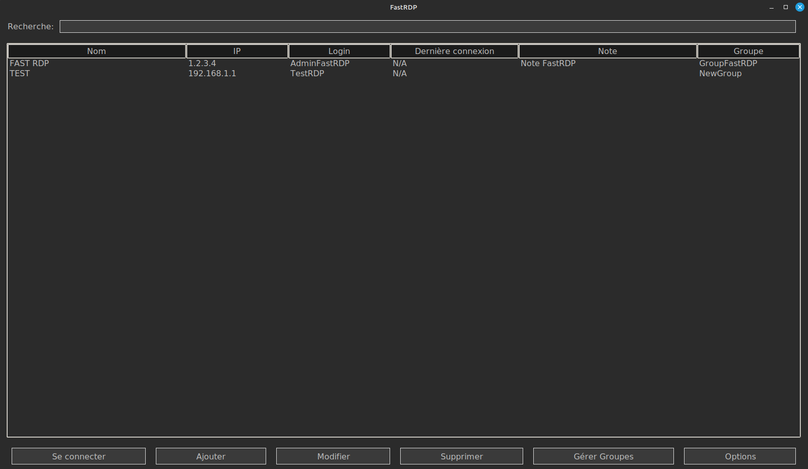
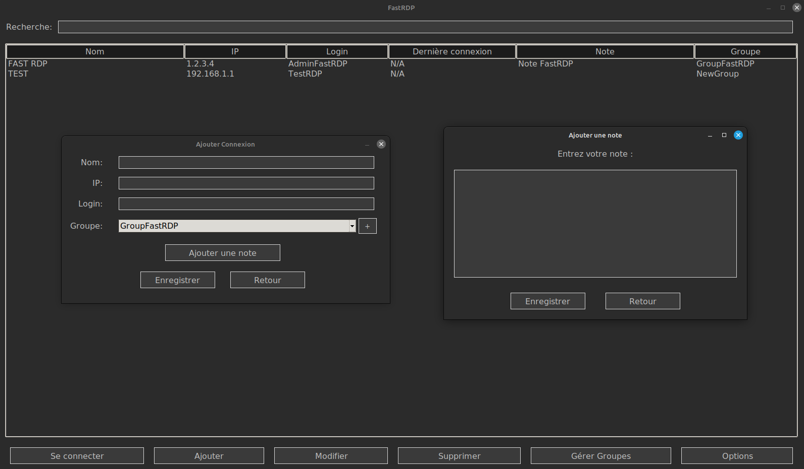

<div style="display: flex; justify-content: space-between;">
  
  
  </div>


# FastRDP – Manuel d'utilisation

FastRDP est un gestionnaire de connexions Bureau à Distance (RDP) développé en Python avec une interface graphique Tkinter. Il vous permet de gérer vos connexions RDP (ajout, modification, suppression, etc.) via une interface conviviale, de sauvegarder ou d’importer/exporter vos configurations et même de vérifier automatiquement les mises à jour depuis un dépôt Git.

## Prérequis

Le script d’installation de FastRDP vérifie et installe automatiquement ces dépendances via **apt**.

## Installation

### Installation via le paquet .deb

FastRDP est distribué sous forme de paquet .deb. Pour installer FastRDP, utilisez la commande suivante afin que les dépendances soient résolues automatiquement :

```bash
sudo apt install ./fastrdp.deb
Une fois installé, FastRDP se trouve dans le répertoire /opt/FastRDP et un raccourci est créé dans le menu des applications.

Utilisation
Lancement
FastRDP est accessible via le menu des applications. Lancez simplement l'application FastRDP depuis votre environnement de bureau.

Interface Principale
L'interface principale de FastRDP comporte :

Champ de Recherche
Permet de filtrer les connexions en fonction de n’importe quel champ (Nom, IP, Login, Groupe, etc.).

Tableau des Connexions
Affiche la liste des connexions enregistrées avec les colonnes suivantes :

Nom
IP
Login
Dernière connexion
Note
Les notes 
Groupe
Boutons de Commande

Se connecter : Lance la connexion RDP à la connexion sélectionnée (après saisie du mot de passe).

Ajouter : Ouvre une fenêtre pour ajouter une nouvelle connexion. Vous pourrez saisir une note via un bouton intégré.

Modifier : Permet de modifier les informations de la connexion sélectionnée.

Supprimer : Supprime la connexion sélectionnée (après confirmation).

Gérer Groupes : Permet d’ajouter ou de supprimer des groupes. 
La suppression d’un groupe vide le champ groupe de toutes les connexions qui l’utilisent.

Options : Accès aux fonctions de configuration (sauvegarde, exportation, importation, suppression de la configuration, mise à jour de FastRDP et support).

Connexion RDP
Sélectionnez une connexion dans le tableau (utilisez le champ de recherche si nécessaire).
Cliquez sur Se connecter ou double-cliquez sur la ligne (en dehors de la colonne "Note") pour lancer la connexion.
Saisissez votre mot de passe dans la fenêtre qui s’ouvre.
Une fenêtre de progression s’affiche pendant l’établissement de la connexion.
Si la connexion est réussie la date de la dernière connexion est mise à jour dans le tableau.
En cas d’échec, un message d’erreur est affiché.

Consultation Complète d’une Note
Les notes sont affichées dans le tableau de manière tronquée pour ne pas perturber la mise en page.
Pour consulter la note complète, double-cliquez sur la cellule de la colonne Note de la connexion désirée. 
Une fenêtre s’ouvrira pour afficher le contenu complet de la note.

Options de Configuration
Dans le menu Options, vous avez accès aux fonctionnalités suivantes :

Sauvegarder la configuration
Choisissez un dossier de destination. FastRDP créera une archive ZIP contenant les fichiers de configurations.

Exporter la configuration
Crée une archive ZIP dans le dossier de votre choix.

Importer la configuration
Sélectionnez une archive ZIP pour importer une configuration préalablement sauvegardée.

Supprimer la configuration
Supprime toutes les connexions et/ou tous les groupes (après confirmation).

Mettre à jour FastRDP
Vérifie si une nouvelle version est disponible. Si oui, FastRDP télécharge puis redémarre automatiquement.
Au lancement, la vérification se fait en arrière-plan sans popup si aucune mise à jour n’est disponible.

Support
Ouvre la page de suivi des problèmes sur GitLab.

Mise à jour Automatique
Au démarrage, FastRDP vérifie en arrière-plan s’il existe une nouvelle version.

Si une mise à jour est détectée et que vous confirmez via le menu Options, l’application se met à jour et redémarre automatiquement.
Si aucune mise à jour n’est disponible au démarrage, aucune popup n’est affichée.